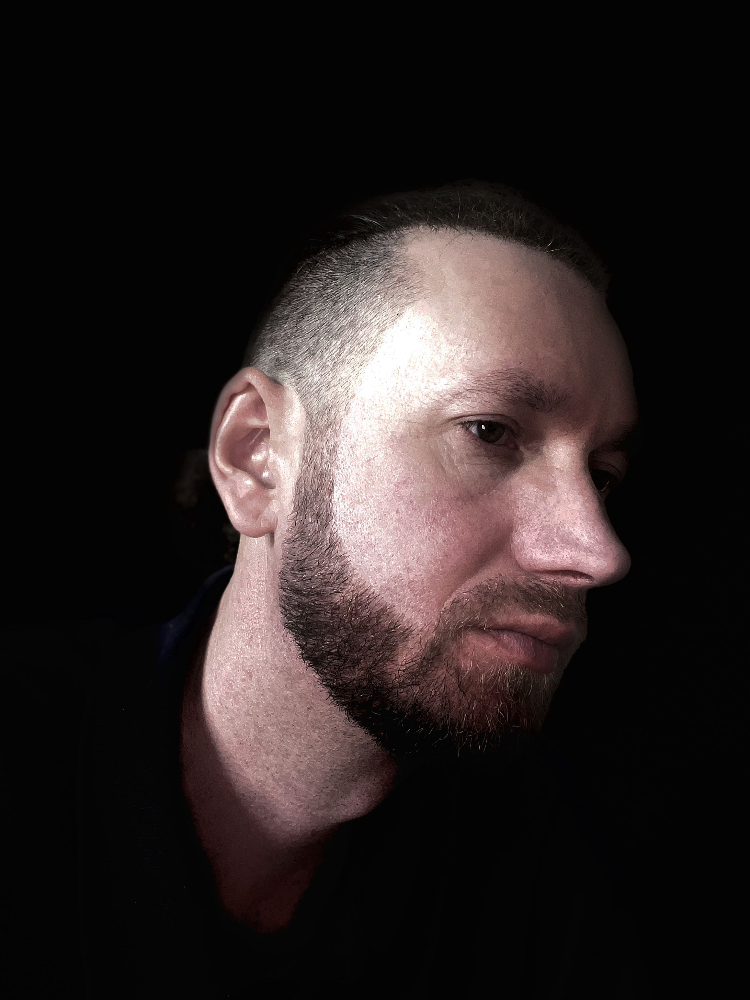

  
   
  <h1>Dumitru Irinel Lazarovici</h1>
  <h3>QA/QC Manager & Junior Cyber Security (GRC)</h3>

 

Welcome to the source code of my **2026 Professional Resume & Portfolio**. This project marks my professional transition, seamlessly blending years of rigorous **QA/QC & Construction Site Management** with a solid foundation in **Cyber Security & GRC (Governance, Risk, and Compliance)**.

## 🎨 The "Midnight Obsidian" Design System

This portfolio was engineered completely from scratch. I consciously moved away from heavy frameworks like Bootstrap to prioritize speed, custom aesthetics, and a premium user experience using **Vanilla HTML5 and CSS3**.

**Key UI/UX Innovations:**

- 🪟 **Glassmorphism:** Elegant, frosted-glass components utilizing `backdrop-filter` for deep visual hierarchy.
- 🌌 **Dynamic Backgrounds:** A subtle "Mesh Gradient" background that feels alive, professional, and tech-forward.
- 📱 **Responsive Architecture:** A flawless 2-column CSS Grid layout that adapts perfectly to mobile, converting the sticky sidebar into an inline profile header without overlapping content.
- ✨ **Micro-Animations:** Smooth hover effects, timeline dot animations, and sequential fade-in loads designed to engage the user.

## 🛠 Skills & Certifications Showcased

| Domain | Focus Areas |
|--------|-------------|
| **QA/QC & Construction** | Site Management, Auditing, Health & Safety Compliance, Team Leadership, Risk Mitigation |
| **Cyber Security (Junior)** | Risk Assessment, Security Policies & Auditing (GRC), Access Controls, Network Security Fundamentals |

### 🏆 Certifications Included

- **Cisco CCST** (Networking Basics)
- **Immersive Labs** (Cyber 101, Intro to Incident Response, Intro to Networking, Ethics & Laws)
- **NCFE Level 3** (Cyber Security)

## 🚀 Deployment (IONOS)

This static architecture is hyper-optimized for seamless deployment. The core structure is straightforward:

- `index.html`: Landing Page & About Summary
- `resume.html`: Professional Timeline, Technical Skills & Verified Certifications
- `contact.html`: Interactive Glassmorphism Contact Form (powered by `contact.php`)

---

  <i>“Bridging the gap between physical site quality assurance and digital infrastructure security.”</i>

